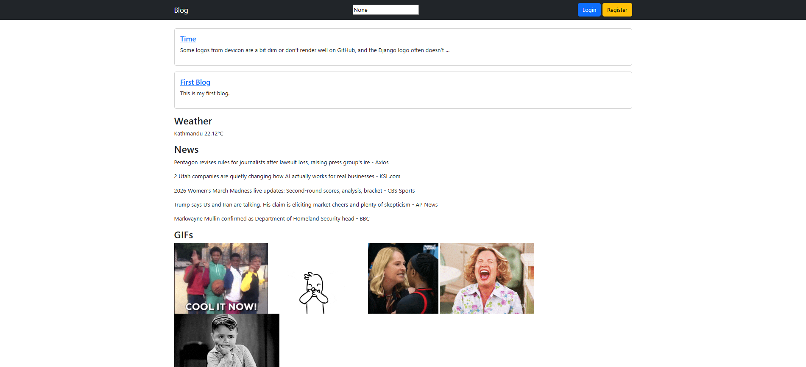
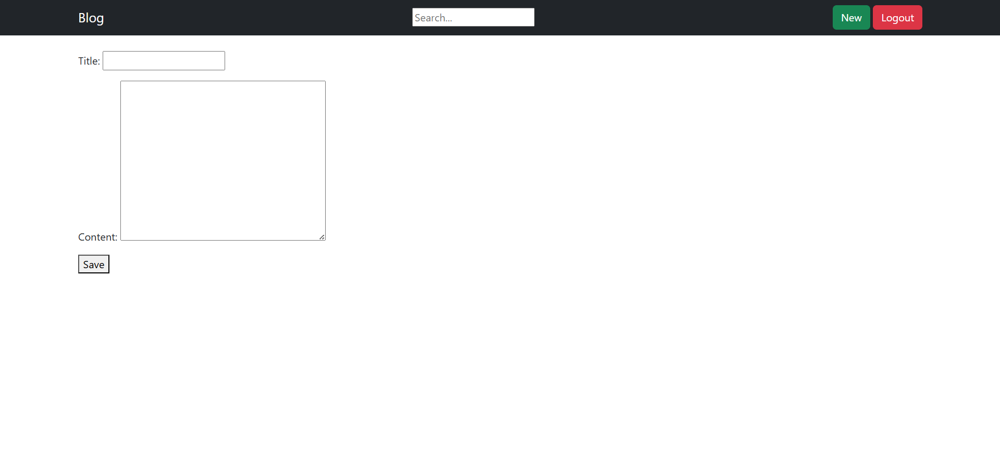
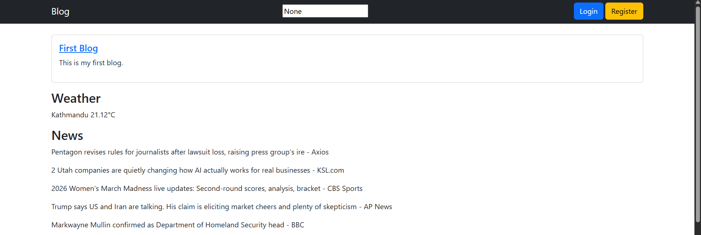
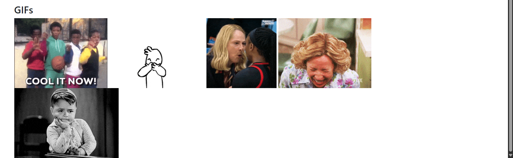
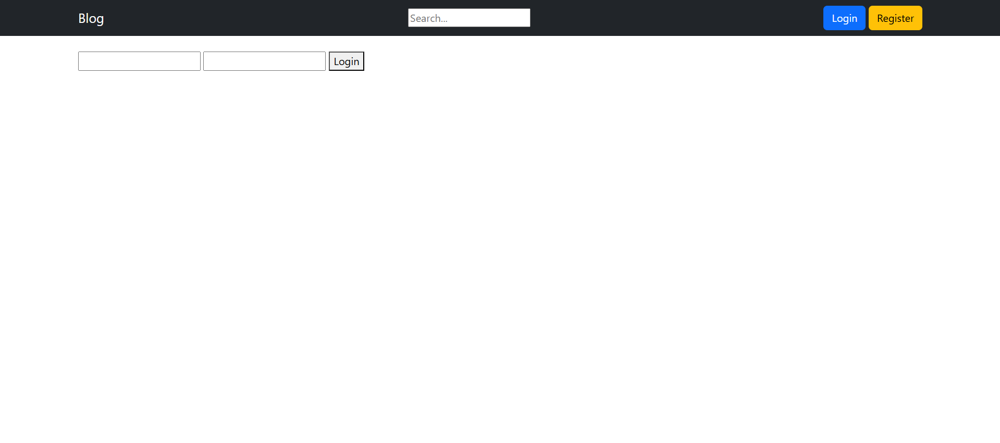
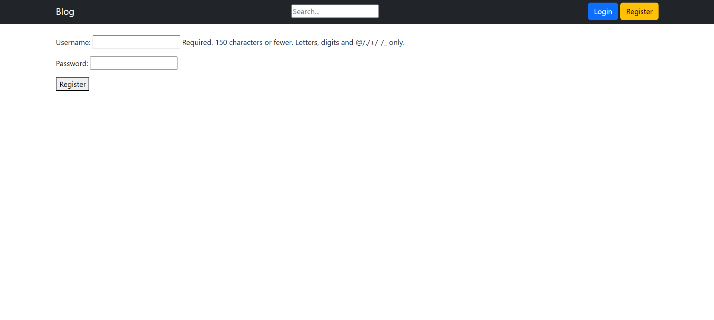

# 📝 Django Blog Platform

<!-- Project Badges / Logos -->
<!-- Project Badges / Logos -->
<p align="center">
  <!-- Python -->
  
  
  <!-- Django -->
  
  
  <!-- HTML5 -->
  
  
  <!-- CSS3 -->
  
  
  <!-- JavaScript -->
  
  
  <!-- Bootstrap -->
  
  
A modern, fully functional **Django blogging platform** with dynamic API integrations. Users can register, login, create, edit, delete, and search posts. Home page displays **live news, weather, and trending GIFs**, giving your blog a dynamic, engaging experience.

---

## 🚀 Features

- ✅ **User authentication**: Registration, login, logout  
- ✅ **Post management**: Create, edit, delete, search posts  
- ✅ **Dynamic news feed** from **NewsAPI**  
- ✅ **Live weather updates** via **OpenWeatherMap API**  
- ✅ **Trending GIFs** using **Giphy API**  
- ✅ **Responsive UI** using Bootstrap 5, custom CSS, and JS hover animations  
- ✅ **Clean, maintainable code structure**  
- ✅ **Secure API keys via `.env`**  

---

## 🎨 Screenshots

> Replace these with actual screenshots from your project  

   
  
  
  
 


---

## ⚙ How It Works

1. Users **register or login** to access post features  
2. Logged-in users can **create, edit, delete posts**  
3. Search functionality allows filtering posts by title keywords  
4. Home page dynamically fetches:
   - Top news headlines from **NewsAPI**  
   - Live weather for a default city from **OpenWeatherMap**  
   - Trending GIFs from **Giphy API**  
5. UI is fully responsive and modern  

---

## 💻 Installation & Setup

### Clone the repo:

```bash
git clone https://github.com/nexverix/django-blog-platform.git
cd django-blog-platform

```

## Create a virtual environment (recommended): 
```
python -m venv venv
``` 
# Windows 
```
venv\Scripts\activate
```
# Mac/Linux
```
source venv/bin/activate
```

## Install dependencies: 
```
pip install -r requirements.txt
```
## Set up .env file in root: 
```
NEWS_API_KEY=your_newsapi_key
WEATHER_API_KEY=your_weather_api_key
GIPHY_API_KEY=your_giphy_api_key
```

## Apply migrations: 
```
python manage.py makemigrations
python manage.py migrate
```

## Create superuser (optional): 
```
python manage.py createsuperuser
```

## Run server: 
```
python manage.py runserver
```

## Open your browser:
```
http://127.0.0.1:8000/
```

## 🛠 Usage 
- Register a new account or login
- Create a new post using the "New Post" button
-Edit or delete your posts
- Search posts using the search bar
- View live news, weather updates, and trending GIFs on the homepage

## 🔑 API Setup 
- NewsAPI → https://newsapi.org/
- OpenWeatherMap → https://openweathermap.org/api
- Giphy API → https://developers.giphy.com

## 📂 Project Structure 
```
blog_platform/
│
├── blog_platform/
│   ├── __init__.py
│   ├── settings.py
│   ├── urls.py
│   ├── asgi.py
│   └── wsgi.py
│
├── blog/
│   ├── migrations/
│   │   └── __init__.py
│   │
│   ├── templates/
│   │   └── blog/
│   │       ├── base.html
│   │       ├── home.html
│   │       ├── post_detail.html
│   │       ├── post_form.html
│   │       ├── login.html
│   │       ├── register.html
│   │       └── delete_confirm.html
│   │
│   ├── static/
│   │   ├── css/style.css
│   │   └── js/main.js
│   │
│   ├── admin.py
│   ├── apps.py
│   ├── models.py
│   ├── forms.py
│   ├── views.py
│   ├── urls.py
│   └── utils.py
│
├── manage.py
└── requirements.txt

```

## ⚖ License
This project is open-source under the MIT License.
